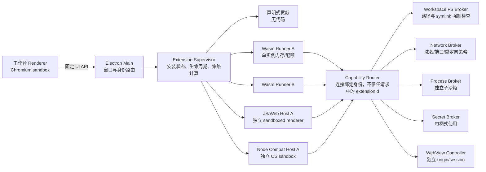

# Logos 扩展边界与沙箱架构

> 状态：安全基线（Extension Host 仍在规划）
> 日期：2026-07-21
> 参考实现：初始审计 `be161a6b320`；当前本地 VS Code 对照 `41fe30d01a19`
> 适用范围：声明式扩展、Wasm 扩展、VS Code Web/Node 兼容扩展、扩展 WebView、LSP/DAP 等扩展子进程

## 1. 结论

Logos 不应把“Extension Host 是独立进程”误当成安全沙箱。安全边界必须同时满足：

1. **默认无权限**：扩展只有自己的只读包、私有存储、受限日志、时钟和随机数；文件、网络、进程、密钥、剪贴板和外部跳转均需显式能力。
2. **每个扩展独立故障域**：第三方 Wasm、Web、Node 扩展不共享 runner 进程，不共享可变宿主状态、模块缓存、环境变量、工作目录或凭据。
3. **能力通过 broker 使用**：扩展不获得主进程、Electron、裸 Node 系统调用或真实绝对路径；所有高权限操作由能力 broker 重新鉴权。
4. **策略由宿主强制执行**：清单声明只是申请，不是授权；扩展自己声称支持“不受信任工作区”不能降低宿主限制。
5. **两层隔离**：Wasm/语言运行时边界负责内存与 API 隔离，OS 沙箱负责在运行时或 broker 出错时继续限制损害。
6. **失败关闭**：某平台缺少要求的 OS 隔离或沙箱探针失败时，只允许运行声明式扩展；Wasm、Web 和 Node 等第三方可执行扩展都不能静默降级。

推荐的运行时优先级是：

| 优先级 | 运行时 | 用途 | 安全定位 |
|---|---|---|---|
| 1 | 声明式 | 主题、语法、菜单、配置、静态贡献 | 不执行扩展代码 |
| 2 | Wasm Component | 新 Logos 扩展 | 默认运行时；显式 imports，最小能力 |
| 3 | Web 兼容宿主 | VS Code `browser` 扩展 | 每扩展一个沙箱化 Chromium renderer |
| 4 | Node 兼容宿主 | 仅有 `main` 的 VS Code 扩展 | 每扩展一个 OS 沙箱进程；兼容性按能力降级 |

“支持 VS Code 扩展”应解释为**清单和 API 的分级兼容**，而不是让任意 VS Code Node 扩展继承当前用户的全部权限。需要原生模块、任意 shell、任意文件或注入宿主进程的扩展默认不兼容；这是一条安全边界，而不是待修复的兼容 bug。

## 2. 当前基线与必须先解决的问题

当前仓库仍未实现 Extension Host，但已经具有扩展包安全基础和工作台 workspace 边界：

- manifest/registry 使用有大小和结构上限的严格 schema；本地开发 registry 实现摘要校验、安全 ZIP 检查、只读内容寻址安装和安装记录。只有声明式 runtime 可安装，可执行 runtime 失败关闭。
- 主窗口使用 `sandbox: true`、`contextIsolation: true`、`nodeIntegration: false` 和 `webviewTag: false`，强制工作台 CSP，并拒绝新窗口、非工作台导航、session 权限请求和 `will-attach-webview`。
- 集中 IPC 注册层要求所有 renderer→main channel 预先声明 schema，并统一校验主窗口 main frame、结构/大小和速率；未知 channel 在注册时失败。
- `WorkspaceAccessController` 将文件服务限制到 canonical workspace 或原生对话框授予的精确路径，拒绝任意 `workspace.setRoot`、路径前缀混淆和指向工作区外的 symlink。Git、终端 cwd、Agent cwd、LSP 与部分调试入口也绑定当前 workspace。
- `EditorArea` 的页面内 `<webview>` 路径和对应 JSX 类型已删除。通用外部打开只允许规范化 HTTPS/`mailto:`，禁止 `file:`/HTTP，并通过原生确认。

这些工作台服务仍不能复用为扩展 API：它们暴露真实绝对路径并面向第一方工作台语义。未来 Extension Host 只能通过连接绑定身份的虚拟 URI broker 使用能力。

剩余的工作台风险是第一方 terminal/debug/agent 启动能力。preload 无法提供不可伪造的 DOM user-gesture 证明；在引入任何第三方 Web 内容前，仍须用主进程授权状态和 Workspace Trust 收口这些高风险启动动作。详细现状和交付拆分见 [`extension-host-implementation-plan.md`](./extension-host-implementation-plan.md)。

## 3. 从 VS Code 借鉴什么、改进什么

### 3.1 借鉴

本地 VS Code 实现中值得保留的架构思想：

- `ExtensionHostKind` 将本地 Node、本地 Web Worker 和远程宿主分开。
- `NativeLocalProcessExtensionHost` 通过独立宿主协议握手、初始化和管理生命周期。
- Web 扩展通过虚拟文件系统 API 访问工作区，而不是直接依赖 Node `fs`。
- WebView 使用独立 origin、`localResourceRoots`、特殊资源 URI、消息通道和 CSP。
- 安装链路包含包签名验证、清单一致性验证和原子提取流程。
- Workspace Trust 在打开陌生项目时抑制任务、调试和项目代码执行。

### 3.2 不照搬

VS Code 的本地 Node Extension Host 主要是**稳定性边界和 API 边界**，不是针对恶意扩展的权限沙箱：

- 多个 Node 扩展可共享宿主，能继承大量环境并使用 Node 标准库。
- 宿主进程通常与当前用户同权限；扩展可绕过 `vscode.workspace.fs` 直接读写文件、发起网络请求或创建进程。
- `allowLoadingUnsignedLibraries` 为原生扩展兼容性扩大了宿主攻击面。
- Workspace Trust 主要处理“项目内容是否可信”，不代表“扩展发布者可信”，也不是文件/网络/进程能力系统。
- WebView 的 `localResourceRoots` 和扩展提供的 CSP 是重要减损措施，但不应作为唯一安全边界。

Logos 因此采用“VS Code 风格的运行位置和协议 + 浏览器风格的权限 + OS 级进程隔离”，并把每个扩展而非一组扩展作为安全主体。

## 4. 威胁模型

### 4.1 需要保护的资产

- 工作区内未公开的源代码、配置、密钥和构建产物。
- 工作区外的用户文件、SSH/GPG 凭据、浏览器资料、云凭据和系统钥匙串。
- Git 身份、Agent 登录信息、API token、远程连接凭据。
- 用户会话、剪贴板、摄像头、麦克风、屏幕、通知和外部 URL handler。
- Logos 主进程、工作台 renderer、其他扩展及其私有存储。
- CPU、内存、磁盘、文件句柄、watcher、网络和进程资源。
- 更新链路、扩展仓库元数据和授权记录。

### 4.2 攻击者

- 主动恶意扩展或被接管的扩展更新。
- 合法扩展中被恶意工作区内容触发的供应链/解析漏洞。
- 恶意 WebView HTML、远程脚本、重定向或服务端响应。
- 构造的 VSIX/ZIP、符号链接、路径穿越、ZIP bomb、清单欺骗。
- 被攻陷的 Marketplace/CDN、吊销后仍在离线运行的包。
- 扩展间消息欺骗、能力 token 重放、IPC 洪泛和资源耗尽。

### 4.3 不承诺解决

- 已控制用户账户或已取得内核/管理员权限的攻击者。
- 用户明确在单独的开发配置中调试自己未签名的扩展后，对该扩展源码本身的信任问题。
- 用户明确通过普通集成终端执行的命令；终端属于用户操作边界，不属于扩展的隐式能力。

即使在开发模式，也不能让扩展代码进入 Logos 主进程或工作台 renderer。

## 5. 信任域与进程架构



### 5.1 主进程

主进程只负责 Electron 生命周期、窗口创建、受控 renderer、连接身份和 broker 启动。它不加载扩展清单脚本，不执行扩展模块，不接受动态 IPC channel，也不把 `ipcMain` 暴露给扩展宿主。

### 5.2 Extension Supervisor

Supervisor 是可信控制面，负责：

- 从已验证的内部清单读取扩展信息。
- 计算有效权限、选择运行时、启动/停止实例和处理崩溃退避。
- 为每个实例创建不可复用的 `instanceId`、连接和 capability 集合。
- 把声明式贡献注册到工作台；不执行来自清单的表达式或代码。
- 记录审计事件、权限变化、包版本和退出原因。

Supervisor 不持有用户密钥，不直接执行 shell，不以扩展提供的路径动态导入代码。

### 5.3 Capability Router

每个扩展实例只有一条专用 `MessagePort`/本地 socket。身份来自 Supervisor 创建连接时的绑定，而不是消息里的 `extensionId`。Router 对每个请求重新检查：

```text
effective = product_policy
          ∩ package_requested_capabilities
          ∩ user_grants
          ∩ workspace_trust_policy
          ∩ runtime_capabilities
          ∩ current_instance_state
```

能力句柄必须绑定 `{packageDigest, extensionId, instanceId, workspaceId, operation, scope, expiry}`，不可跨连接、跨工作区、跨版本或跨重启使用。高权限 broker 不接受扩展自报身份，也不接受来自 WebView 的直接连接。

### 5.4 物理隔离要求

- 第三方可执行扩展：默认一扩展一 runner 进程，包括 Wasm、Web 和 Node。以后若要池化 Wasm，必须先证明 runtime escape、资源耗尽和宿主 import 状态都不会跨扩展扩大影响；池化不能作为初始实现。
- WebView：一面板一 renderer、一随机 origin；同一扩展的不同面板也不共享 DOM、cookie 或 storage。
- LSP/DAP/任务进程：由 Process Broker 创建独立“工具沙箱”，不成为扩展宿主的子进程。
- 文件、网络、进程、密钥 broker 至少保持逻辑分离；第三方可执行扩展 GA 前必须物理分进程，并给 broker 自身施加最小 OS 权限：FS Broker 只有已打开的 workspace/storage handle 且无网络，Network Broker 有网络但无用户文件，Secret Broker 只有凭据存储且不能直接联网，Process Broker 只负责创建更低权限的工具沙箱。任何 broker 都不能成为“缩小版全权限主进程”。

## 6. 运行时分级

### 6.1 声明式扩展

主题、语言配置、TextMate grammar、图标、菜单、键位和静态配置由严格 schema 解析为内部 IR。要求：

- JSON 解析有深度、字段数和字符串长度上限。
- `when`/selector 使用宿主解析器和无副作用 DSL，不允许 `eval`、正则灾难性回溯或动态 import。
- 图片、字体、语法文件来自只读内容寻址包；SVG 默认栅格化或经过净化，不在工作台 DOM 中直接执行。
- 未声明入口点的包不启动运行时。

### 6.2 Wasm Component（默认）

新扩展使用 Component Model/WIT 接口。建议使用独立的安全型 Wasm runtime sidecar（例如 Wasmtime），**不以 Node `node:wasi` 作为不受信任代码的安全边界**。

Wasm 实例只导入 Logos WIT 能力，例如：

```wit
interface workspace-read {
  read: func(uri: string, offset: u64, max-bytes: u32) -> result<list<u8>, error>;
}

interface editor-registration {
  register-completion: func(selector: selector) -> result<resource<registration>, error>;
}
```

要求：

- 每实例独立 store/linear memory/table；不共享可变宿主对象。
- 使用 fuel/epoch interruption、内存上限、栈上限和同步调用 deadline。
- 不默认启用 WASI filesystem/network/process；需要文件时调用 Logos URI broker。
- AOT cache 以 `{runtimeVersion, target, packageDigest}` 为键，cache 文件不可由扩展写入。
- 宿主 import 对所有长度、索引、UTF-8、handle 和 reentrancy 做校验。
- Wasm runtime 自身仍放在无网络、无用户目录访问的 OS 沙箱进程中，防御 runtime/JIT 漏洞。

### 6.3 VS Code Web 兼容宿主

- 把 VS Code `browser` 入口装入专用、不可见的 sandboxed renderer；不在工作台 renderer 中创建普通 Worker。
- 每个扩展使用唯一的 `logos-extension://<digest>` origin 和临时 session。
- 提供兼容的 `vscode` 模块 facade，文件访问映射到虚拟 URI broker。
- 禁止 Worker/iframe 任意联网；`fetch`、WebSocket 等经网络策略代理或被拒绝。
- 禁止动态远程代码、`eval`、`new Function` 和未声明的 Wasm；CSP 由宿主设置且扩展不能放宽。
- 运行时进程与其他扩展进程必须不同；如果平台无法保证独立故障域则拒绝启动。

### 6.4 VS Code Node 兼容宿主

Node 兼容层是受限兼容，不是安全后门：

- 每个扩展一个专用进程和 OS 沙箱；`cwd` 是空的私有运行目录，不是工作区。
- 环境变量采用允许列表构造；不继承 `process.env`。默认只有 locale、受控 `PATH` 标识和非敏感运行信息。
- `vscode` API 经专用 RPC facade 提供。
- 自定义 module loader 默认拒绝 `electron`、`child_process`、`worker_threads`、`cluster`、`vm`、`inspector`、裸 `fs`、裸网络模块和任意 native addon；可兼容的 Node API由无权限 shim 提供。
- OS 沙箱作为 loader 绕过、运行时漏洞和第三方依赖漏洞的第二层防护。
- `process.spawn` 权限不会把 `child_process` 原样交给扩展；它只允许调用 Process Broker 的受控命令描述。
- `.node` 原生模块默认拒绝。确有必要的官方适配器放入单独的 Native Adapter 进程，要求平台签名、固定哈希和专门审查；不能在 Extension Host 内加载。

扩展管理器在安装前显示兼容性结果：`安全兼容`、`需要授权`、`API 不支持` 或 `含原生/任意执行能力，已阻止`，不能启动后才静默失败。

## 7. 权限模型

### 7.1 清单只声明申请

扩展包使用可规范化、可签名的权限清单。示例：

```json
{
  "engines": { "logos": "^1.0.0" },
  "logos": {
    "runtime": {
      "kind": "wasm-component",
      "entry": "dist/extension.wasm",
      "world": "logos:extension/command@1.0.0"
    },
    "permissions": [
      {
        "id": "workspace.read",
        "scope": { "globs": ["**/*.rs", "Cargo.toml"], "sensitive": false },
        "reason": "为 Rust 文件提供导航"
      },
      {
        "id": "network.http",
        "scope": { "origins": ["https://api.example.com:443"], "methods": ["GET"] },
        "reason": "查询公开文档索引"
      }
    ]
  }
}
```

Installer 把外部格式转换为排序、去歧义的内部 IR 后再签名/存储/比较。未知 permission、模糊 host、空 glob、重叠冲突 scope、运行时不支持的能力都在安装阶段拒绝。`reason` 仅用于提示，不能扩大 scope。VS Code `package.json` 没有等价权限声明时，由兼容性扫描器保守推导候选权限并要求用户确认；无法可靠推导的动态能力保持拒绝。

### 7.2 默认能力

无需提示、自动提供：

- 读取自己的已验证只读包。
- 访问自己的 namespaced storage（建议默认 50 MiB，可由产品策略调整）。
- 写入带扩展 ID 的限速日志。
- 单调时钟、受控 wall clock、CSPRNG。
- 注册清单已声明的编辑器贡献。

其他能力默认拒绝。

### 7.3 权限分类

| 能力 | 可约束范围 | 默认授权策略 |
|---|---|---|
| `workspace.read` | workspace、glob、最大字节数、是否含隐藏文件 | 首次使用/安装确认 |
| `workspace.write` | workspace、glob、create/modify/delete 分离 | 高风险，显式确认 |
| `workspace.watch` | glob、watcher 数、事件速率 | 依赖 read |
| `network.http` | scheme、精确域/子域、端口、方法、流量 | 默认拒绝，按目的地授权 |
| `process.run` | 工具 ID、可执行哈希、参数 schema、cwd、超时 | 高风险；需工作区可信 |
| `terminal.create` | 是否可见、profile、cwd | 极高风险；通常逐次确认 |
| `debug.adapter` | adapter ID、transport、目标类型 | 需工作区可信，独立沙箱 |
| `secret.use` | secret 名称、允许的目标服务 | 句柄式，优先于读取明文 |
| `secret.read` | 单个 secret | 极高风险，默认不允许持久授权 |
| `clipboard.read/write` | 用户手势、格式、字节数 | 逐次或短期授权 |
| `external.open` | `https`/`mailto`、域名、用户手势 | 逐次确认或域授权 |
| `webview.create` | viewType、script、资源根 | 安装时声明 |
| `extension.connect` | 明确的目标扩展和协议版本 | 双方声明、broker 中转 |
| `native.adapter` | 固定签名和哈希 | 仅受信发布者/官方组件 |

`workspace.read` 不自动包含 `.env`、密钥、SSH 配置或工作区外 symlink 目标。敏感文件模式由产品策略覆盖，普通扩展不能通过更宽 glob 解除；确有需要时使用单文件、短期的 `workspace.sensitiveRead` 授权。

### 7.4 授权生命周期

支持：`本次操作`、`本次会话`、`此工作区`、`此用户配置`、`拒绝`。规则：

- 授权记录绑定扩展发布者身份、包 digest、主版本、能力和 scope。
- 更新新增或扩大能力时，旧实例先停止，新版本在重新确认前不激活。
- `secret.read`、任意可执行、工作区外写入等能力不提供永久“全部允许”。
- 权限提示展示具体资源和原因，禁止只显示模糊的“需要文件权限”。
- 扩展在 manifest 中提供的理由仅作说明，不能影响策略计算。
- 用户撤销权限后立即吊销 capability、取消进行中操作并通知实例；不能等重启。

### 7.5 工作区信任与扩展信任分离

- **扩展信任**回答“是否允许这个发布者的这份代码运行”。
- **工作区信任**回答“是否允许扩展把当前项目内容当作代码、配置或命令执行”。

不受信任工作区中：

- 禁止任务、调试、终端、workspace executable、workspace SDK/plugin 自动加载。
- workspace setting 中会影响命令、模块路径、网络目标和动态代码的字段不传给扩展。
- 只读能力仍应用敏感文件过滤；写能力默认降为拒绝。
- 扩展清单声明 `supportsUntrustedWorkspace` 只能让纯阅读功能继续运行，不能恢复宿主禁止的能力。

## 8. 文件系统边界

扩展 API 使用 `logos-workspace://<workspaceId>/path`、`logos-storage://<extensionId>/...` 等虚拟 URI，不暴露真实绝对路径。

FS Broker 要求：

1. URI 解析后拒绝 NUL、设备路径、保留名、alternate data stream、UNC/网络路径和非规范编码。
2. 从已打开的 workspace root handle/fd 相对遍历；每段检查，避免“先 realpath 再 open”的 TOCTOU。
3. 默认不跟随 symlink。显式允许时，每次访问都验证最终对象仍在获授权 root 内；跨 root 一律拒绝。
4. glob 在规范化的逻辑 workspace path 上计算，且不能覆盖宿主敏感文件 denylist。
5. 写入采用临时文件 + fsync + 同目录原子替换，并复核目标身份；删除移入可恢复 trash，除非用户明确允许永久删除。
6. 限制单次/会话字节数、目录项数、递归深度、并发数和 watcher 数。
7. 返回内容流而不是任意共享内存；每个 chunk 有上限并支持取消和 backpressure。
8. 权限错误不泄露工作区外路径是否存在。

扩展存储按 `{publisher, extension, profile}` 隔离，版本回滚使用显式迁移快照；一个扩展不能枚举其他扩展的 storage。

## 9. 网络边界

扩展宿主无直接 socket 权限。Network Broker 实施：

- 默认仅 HTTPS/WSS；HTTP、任意 TCP/UDP、监听端口需要更高等级能力且通常拒绝。
- host 使用 IDNA/大小写/末尾点规范化后匹配；通配符只匹配 DNS label，不接受字符串后缀匹配。
- DNS 解析前后检查 IP，默认拒绝 loopback、link-local、私网、云 metadata、组播和 Unix socket。
- 每次重定向重新检查 scheme、host、port 和授权；限制重定向次数。
- 连接绑定已验证的解析结果，防止 DNS rebinding；代理和 PAC 不能绕过目标策略。
- 限制方法、请求/响应大小、速率、并发、超时；日志只记目标元数据，不记 token/body。
- TLS 验证不可由扩展关闭；客户端证书和系统认证必须经用户确认。
- WebView 与 Extension Host 分别计费和授权，WebView 页面不能借用宿主已有网络 capability。

密钥优先以 `secret.use` 方式由 broker 在获准的目标请求中注入 header，扩展只持有用途受限的句柄。只有协议无法代理时才考虑 `secret.read`。

## 10. 进程、终端、LSP 与 DAP

扩展永远不直接调用 `spawn`/PTY。Process Broker 接受结构化请求：

```ts
type ToolLaunch = {
  toolId: string;                 // 安装时解析的工具身份，不是任意路径
  args: readonly string[];        // 按 tool schema 校验
  cwd: WorkspaceUri;
  input?: "none" | "pipe";
  timeoutMs: number;
  network: "none" | NetworkGrantId;
  writes: readonly WorkspaceScope[];
};
```

要求：

- 可执行文件来自 Logos 签名工具包、扩展只读包，或用户在可信工作区中逐次确认的固定文件；启动前复核 digest。
- 不经 shell 拼接；参数数组与环境分开，禁止扩展控制 loader 相关环境变量。
- 子进程进入独立 OS 沙箱、进程组/job object；父扩展退出时整组终止。
- 默认无网络、工作区只读、空 HOME、私有 TMP、最小 PATH 和无继承凭据。
- stdout/stderr 按字节和速率限制并去除危险控制序列；不可伪造工作台 UI 或终端输入。
- 需要交互终端时显示明确的“由扩展 X 创建”标识，写入输入必须来自用户或单独授权。
- LSP、DAP、formatter、compiler 分别使用工具身份和独立策略；不能因为扩展已有 `workspace.read` 就自动获得执行权限。

## 11. WebView 边界

扩展 WebView 不使用页面内 `<webview>` 标签。由 WebView Controller 创建受控 `WebContentsView` 或专用 sandboxed renderer：

- `sandbox: true`、`contextIsolation: true`、`nodeIntegration: false`、`webSecurity: true`。
- 固定且由 Logos 签名的 preload，只暴露冻结的 `postMessage/getState/setState`；不暴露 IPC、文件、shell 或 Electron 对象。
- 每面板随机 `logos-webview://<originNonce>` origin 和内存 session；禁用共享 cookie/cache、service worker、下载、拼写扩展和生产 DevTools。
- `setPermissionRequestHandler`/`setPermissionCheckHandler` 默认拒绝 media、geolocation、notifications、USB、serial、HID、MIDI、screen capture、local network 等权限。
- `will-navigate` 一律拦截；`window.open` 一律拒绝，外部 URL 只能发消息给 Controller，再经过 `external.open` 策略和用户手势检查。
- 仅允许 `logos-resource://<panelCapability>/...` 读取扩展资源或已授权 workspace root；URL capability 与 panel、路径 scope、过期时间绑定。
- HTML 作为不可信数据加载，宿主通过 response header 强制 CSP。扩展只能收紧，不能放宽。

默认 CSP 基线：

```text
default-src 'none';
base-uri 'none'; object-src 'none'; frame-src 'none'; form-action 'none';
img-src logos-resource: data:;
font-src logos-resource:;
style-src logos-resource: 'nonce-<host nonce>';
script-src 'nonce-<host nonce>';
connect-src 'none';
```

只有 manifest 声明并获授权时才启用脚本。宿主重写/注入 nonce，并限制 HTML 大小、DOM 消息大小、消息速率和 transferable 类型。每条 WebView 消息带内部 panel identity；扩展只能接收自己面板的消息。

## 12. 包、签名与供应链

### 目标架构（尚未实现）

规划中的安装应发生在独立、隔离的 Installer 进程。独立进程、隔离安装、发布者签名/吊销、仓库新鲜度与回滚保护、SBOM、启动前入口复核等校验目前均未实现；以下步骤保留为未来设计目标：

1. 下载到 staging，不执行 postinstall/install script，不解析工作区文件。
2. 验证仓库元数据的新鲜度和回滚保护；验证仓库对 `{publisher, extensionId, version, digest}` 的绑定。
3. 验证发布者签名、证书/密钥状态和吊销信息。Marketplace 包默认必须签名。
4. 流式检查 ZIP：拒绝绝对路径、`..`、重复/大小写冲突项、symlink/hardlink/device、超限条目、压缩比、深度和总展开大小。
5. 解析清单并与仓库身份、版本、入口、平台和 digest 对照；生成规范化内部 manifest。
6. 生成权限/兼容性 diff、SBOM 和文件哈希表；在用户同意前不激活。
7. 提取到内容寻址目录 `<digest>`，权限只读；通过原子指针切换版本。
8. 启动前再次核对入口 digest。异常退出可回滚，但回滚版本仍需未被吊销。

当前实现仍位于 `src/electron/services/extensions.ts` 的主进程 IPC 服务中。它仅面向未打包构建的本地 registry；实际安装时会在该服务内完成归档 staging、SHA-256 校验、安全 ZIP 检查与解包、只读内容寻址存储和安装记录写入。这些已有校验不是独立 Installer 进程形成的安全边界，也不包含上述签名、吊销和隔离安装能力。

Extension Development Profile 同样是尚未实现的目标约束：本地未签名扩展将来只能在显式开发配置中运行，并须使用独立用户数据目录、显示明显的开发模式 UI 标识、默认禁用网络/密钥/进程能力，且授权记录不得与普通配置互用。当前本地 registry 仅由 `LOGOS_EXTENSION_REGISTRY` 和 `app.isPackaged` 决定是否可见，仍使用普通用户数据目录，也没有独立 UI、能力默认策略或授权记录存储；不能把该开关描述成已经完成的安全隔离。当前阶段也尚不执行第三方扩展代码。

更新时只下载并验证完整目标；delta 只是传输优化，最终产物仍按完整 digest 验证。离线吊销缓存有过期时间；高风险被吊销扩展立即停用并保留可审计原因。

## 13. IPC/ABI 设计

不提供字符串到任意方法的动态反射。协议使用版本化、长度前缀 envelope：

```ts
type Envelope<T> = {
  protocol: 1;
  requestId: bigint;
  method: KnownMethodId;
  capability: CapabilityHandle;
  deadlineMs: number;
  body: T;
};
```

约束：

- 连接握手包含双方版本、随机 nonce、package digest 和 Supervisor 签名的 init 数据。
- 每个 method 有独立请求/响应 schema、最大序列化大小、deadline 和 cancellation。
- 禁止 prototype-bearing 对象、函数、DOM/Electron handle 和任意文件 descriptor 传输。
- 流量使用信用/backpressure；默认单消息不超过 1 MiB、实例队列不超过 8 MiB，超限断开。具体数值可由产品策略调优，但不能由扩展提高。
- 未知字段默认拒绝；仅在明确标记的向前兼容结构中忽略未知字段。
- requestId、capability handle 和响应只能在原连接使用，重复响应或重放记为安全事件。
- Router 对连续 schema 错误、拒绝请求和洪泛使用熔断，停止实例而不是拖垮工作台。

VS Code 兼容 RPC 在适配层结束，内部 broker 不直接接受 VS Code 的宽泛参数结构。

## 14. 资源治理与生命周期

建议初始默认值（需基准测试后固化）：

- Wasm/JS 实例内存 128 MiB，Node 兼容实例 256 MiB。
- 交互回调 100 ms soft deadline，5 s hard deadline；后台任务必须显式声明并可取消。
- 私有存储 50 MiB，日志滚动 10 MiB，单次消息 1 MiB。
- watcher 100 个、并发 broker 请求 32 个、未消费事件队列 1,000 条。

治理规则：

- Wasm 用 fuel/epoch；JS/Node 用进程级 CPU、内存和句柄监控。
- OOM、CPU 超限、事件循环卡死、协议错误分别记录，不自动归因于工作台崩溃。
- 重启使用指数退避；同版本连续崩溃进入 quarantine，需用户操作恢复。
- 工作区关闭、扩展禁用、权限撤销、更新切换时先停止新请求，短暂执行 deactivate，然后强杀整个进程树。
- UI 必须显示“哪个扩展占用资源、访问了什么能力、为什么被停止”。

## 15. 平台强制层

业务权限永远由 broker 执行；OS 沙箱用于阻止扩展绕过 broker。

### macOS

- 使用单独签名的 Extension Runner helper，开启 App Sandbox 和 Hardened Runtime。
- Runner 默认无用户文件、网络、Apple Events、摄像头、麦克风等 entitlement；数据经 broker IPC。
- 不把 `sandbox-exec` 当作生产安全边界。
- 不为普通扩展启用 `allowLoadingUnsignedLibraries`；需要 native adapter 时使用单独、受信、固定签名的 helper。
- Electron utility process 的 `disclaim` 只解决 TCC 责任归属，不等于沙箱；可作为额外措施，不能替代 App Sandbox/broker。

### Linux

- 专用 launcher 使用 user/mount/pid/network namespace、只读根、私有 `/tmp`、最小 `/proc`、no-new-privileges、seccomp 和 Landlock。
- 宿主默认无网络 namespace 出口；需要网络仍经 broker。
- 检测内核/发行版能力并运行启动 probe。要求的隔离不可用时，所有第三方可执行扩展失败关闭，只保留声明式扩展。

### Windows

- 使用 AppContainer/LPAC、低完整性 token、Job Object、进程/内存/UI 限制和适用的 mitigation policy。
- 默认不授予 `internetClient`、私网、注册表、剪贴板或用户文件 capability；通过 broker 访问。
- 每个扩展独立 AppContainer identity，私有 storage DACL 只授予对应 SID。
- 子进程必须进入受控 Job/AppContainer；扩展进程退出后不能遗留后台进程。

所有平台在 CI/发布包中运行“沙箱探针扩展”，主动尝试读取 home、访问 loopback/metadata、创建进程、读取环境、打开其他扩展 storage 和逃逸 symlink；任一成功都阻止发布。

## 16. 审计、隐私和响应

本地审计日志至少记录：

- 包安装/更新/回滚/吊销、签名身份和 digest。
- 权限申请、用户决定、授权 scope、撤销和版本能力 diff。
- broker 操作的类型、范围、结果、字节数和耗时。
- sandbox violation、协议错误、崩溃、资源超限和 quarantine。

日志不记录文件内容、请求 body、密钥、完整命令敏感参数或 WebView 消息。路径默认显示 workspace 相对路径，工作区外路径做脱敏。遥测必须聚合且遵守用户设置；安全审计日志默认仅本地。

支持仓库签名的紧急策略：按 publisher/key/package digest 吊销、收缩 capability、禁止特定 runtime/API 版本。策略文件必须防回滚、可离线验证，并保留用户可读原因。

## 17. 实施顺序

### Phase 0：工作台安全基线

- 已落地：Chromium sandbox/context isolation、导航/弹窗/权限拒绝、强制 CSP、集中 IPC sender/schema/大小/限流、workspace/dialog file authority、外部 URL 原生确认和页面内 `<webview>` 移除。
- 已落地：覆盖未知 IPC、非 main-frame、超大载荷、洪泛、任意 workspace root、路径前缀混淆、外部 symlink 和对话框授权撤销的安全回归测试。
- 接入第三方 Web 内容前仍需完成：第一方 terminal/debug/agent 高风险启动动作与主进程授权状态、Workspace Trust 的绑定。

**当前退出条件**：renderer 不能直接获得 Node/Electron 或工作区外文件，未声明/畸形 IPC 失败关闭；但工作台 renderer 仍能请求第一方 shell/调试/Agent 能力，因此“renderer XSS 不能获得 shell”的完整条件尚未达到。此缺口不允许用 CSP 或 sender 校验替代，也不阻塞继续开发无代码声明式贡献；它阻塞第三方 Web 内容进入工作台 renderer。

### Phase 1：包与声明式贡献

- 内部 manifest IR、签名/仓库元数据验证、隔离解包、内容寻址存储。
- 权限数据库、权限 diff UI、审计日志。
- 主题/grammar/菜单/配置等无代码贡献。

**退出条件**：恶意包在未执行任何扩展代码时也不能路径穿越、覆盖文件或通过声明式字段执行代码。

### Phase 2：Wasm Host

- Rust Wasm runner、WIT SDK、Capability Router、FS broker、配额/取消。
- 每平台 OS 沙箱与探针测试。

**退出条件**：恶意 Wasm 只能访问授予的虚拟资源；runtime escape 仍被 OS 沙箱限制。

### Phase 3：Web 扩展与 WebView

- 每扩展 sandboxed renderer、VS Code Web API adapter。
- 受控 WebView Controller、资源 protocol、网络 broker。

**退出条件**：恶意页面不能导航、弹窗、注册持久 worker、访问默认 session 或直接读本地文件。

### Phase 4：Node 兼容层

- 自定义 loader/facade、每扩展 OS 沙箱、Process/Secret broker。
- 兼容性扫描器和明确的拒绝原因。

**退出条件**：`require('fs'|'child_process'|'net'|'electron')`、native addon、环境变量、symlink/DNS/IPC 绕过测试全部失败关闭。

### Phase 5：远程扩展宿主

- 远端使用相同 package digest、capability 模型和实例身份。
- mTLS/设备身份、远端策略证明、端到端协议版本和撤销。
- 本地 UI 不因“远程”而自动信任扩展，远端 workspace 权限也不能转换为本机权限。

## 18. 安全验收矩阵

| 场景 | 期望结果 |
|---|---|
| 扩展读取 `~/.ssh`、钥匙串、其他 workspace | broker 和 OS 双重拒绝 |
| workspace 内 symlink 指向 workspace 外 | 默认拒绝；无 TOCTOU 绕过 |
| 网络重定向到 `127.0.0.1`/metadata/private IP | 每跳复核并拒绝 |
| 扩展伪造另一个 `extensionId` 或重放 token | 连接身份不匹配，断开并审计 |
| 两个扩展尝试共享内存/模块/storage | 进程与 namespace 隔离 |
| WebView XSS | 只能在当前 panel origin 内运行，不能获得扩展或工作台 API |
| 恶意 ZIP/签名回滚/清单身份不一致 | 激活前拒绝，staging 可安全清理 |
| Node 扩展直接 `spawn` 或加载 `.node` | loader 拒绝，OS 沙箱继续兜底 |
| 扩展耗尽 CPU/内存/IPC 队列 | 只终止该实例，工作台可用 |
| 权限在运行中撤销 | capability 即时失效，进行中操作取消 |
| 更新新增权限 | 新版本不激活，先显示精确 diff |
| 不受信任 workspace 诱导执行本地工具 | Process Broker 拒绝 |
| 平台沙箱缺失或 probe 失败 | 所有第三方可执行扩展不启动，不降级 |

测试层次包括 unit、property test、RPC/manifest/ZIP fuzz、恶意扩展集成测试、平台逃逸探针、故障注入和更新/吊销演练。安全相关 parser 与 broker 需要独立覆盖率门槛和人工 review owner。

## 19. 明确不采用的方案

- **所有扩展共享一个 Node Extension Host**：扩展间无法形成安全边界，单个逃逸获得全部扩展数据。
- **只用 `node:wasi` + `preopens`**：Node 官方不把当前 WASI 实现视为安全沙箱。
- **只靠 JS monkey patch 禁止 `fs`/`net`**：可被 loader、native addon、运行时漏洞或依赖绕过。
- **只靠工作区信任**：它不解决恶意扩展、扩展更新和扩展间隔离。
- **用户一次确认“完全信任此扩展”后给全部用户权限**：授权不可审计、不可最小化，更新供应链风险过大。
- **WebView 直接使用 `file://` 或默认 Electron session**：会扩大本地资源、cookie、权限和导航攻击面。
- **缺少 OS 沙箱时自动回退普通子进程**：破坏跨平台安全承诺。
- **把 LSP/DAP/formatter 当作普通扩展子进程**：工具经常解析或执行工作区内容，必须有独立策略和生命周期。

## 20. 参考资料

本地 VS Code 参考（初始审计 `be161a6b320`，当前复核 `41fe30d01a19`）：

- `src/vs/platform/extensions/electron-main/extensionHostStarter.ts`
- `src/vs/workbench/services/extensions/electron-browser/localProcessExtensionHost.ts`
- `src/vs/workbench/services/extensions/browser/webWorkerExtensionHost.ts`
- `src/vs/workbench/services/extensions/electron-browser/nativeExtensionService.ts`
- `src/vs/workbench/contrib/webview/browser/webviewElement.ts`
- `src/vs/platform/extensionManagement/node/extensionDownloader.ts`
- `src/vs/platform/extensionManagement/node/extensionManagementService.ts`

外部一手资料：

- [Electron Security](https://www.electronjs.org/docs/latest/tutorial/security)
- [Electron Process Sandboxing](https://www.electronjs.org/docs/latest/tutorial/sandbox/)
- [Electron utilityProcess](https://www.electronjs.org/docs/latest/api/utility-process)
- [Node.js WASI security](https://nodejs.org/api/wasi.html#security)
- [Wasmtime Security](https://docs.wasmtime.dev/security.html)
- [VS Code Web Extensions](https://code.visualstudio.com/api/extension-guides/web-extensions)
- [VS Code Webview API](https://code.visualstudio.com/api/extension-guides/webview)
- [VS Code Workspace Trust Extension Guide](https://code.visualstudio.com/api/extension-guides/workspace-trust)
- [Apple App Sandbox](https://developer.apple.com/documentation/security/app-sandbox)
- [Linux Landlock](https://landlock.io/)
- [Windows AppContainer](https://learn.microsoft.com/en-us/windows/win32/secauthz/implementing-an-appcontainer)
